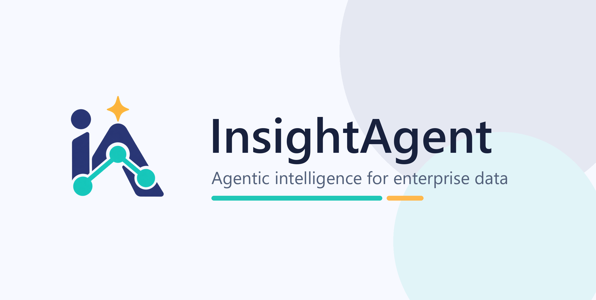
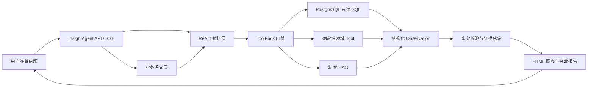

# InsightAgent

> 企业经营数据与知识协同分析智能体

<p align="center">
  
</p>

InsightAgent 面向企业经营分析，将 PostgreSQL 经营事实、合成制度知识库、
确定性领域工具与可审计评测体系组织成一条 ReAct 工作流。首个验证场景是
汽车配件销售，支持自然语言问数、销售下滑诊断、客户风险识别、经销商健康度、
制度检索与带引用的 HTML 报告。

## 主演示问题

> 分析 2026 年第二季度华东区域刹车系统配件销售下滑的主要因素，
> 并结合经销商管理制度提出改进建议，生成带图表和引用依据的经营分析报告。

固定合成数据的可复核结果：

- 2026Q2 华东刹车系统销售额 1,087,378.79 元，环比 -32.6794%，同比 -29.2719%；
- 经销商渠道对净下降的贡献为 74.8917%；
- 平均折扣率上升 4.1782 个百分点，毛利率下降 2.7839 个百分点；
- 华南同品类同比 +17.0038%，表明该异常不是全国性品类下降。

这些结论表示可验证的下降贡献与同期变化，不把相关性包装成唯一因果关系。

## 架构



详细模块、时序与源码映射见
[`insight_agent/ARCHITECTURE.md`](insight_agent/ARCHITECTURE.md)。

## 项目实现

- 4 张业务表、60,000 条固定种子合成销售明细与 Gold Truth；
- 6 份合成企业制度与 4 份仅用于评测的旧版/干扰文档；
- 销售诊断、客户流失预警、经销商健康度 3 个参数化 SQL Tool；
- 指标、时间、维度、字段关系与高风险歧义规则组成的 YAML 业务语义层；
- Tool 顺序门禁、参数 Schema 校验、只读 SQL 预检与数据库只读角色；
- 9 类 SQL 错误反馈、脱敏 Observation、最多一次纠正与重复 SQL 阻断；
- 10 类统一故障语义、请求级重试预算、稳定指纹断路器与 `success/failed/partial` 完成合同；
- V1、Text-to-SQL、Tool Calling、RAG 四套冻结评测及原始轨迹归档；
- 多意图 RAG 子问题拆分、跨文档证据扩展、章节引用与拒答检查。

第三方组件的包名、导入路径、依赖声明和许可证保持原样；项目文档只陈述
InsightAgent 自身的模块、行为与实测结果，不把通用依赖能力计入个人实现。

## 业务语义层

`insight_agent/semantic/business_glossary.yaml` 版本化维护指标公式、单位、同义词、
Schema 字段含义和高风险歧义规则。运行时只注入与当前问题相关的定义。
`baseline/comments/glossary/combined` 四种 Profile 支持可复现实验，默认使用
`combined`。

“哪个区域最好”这类缺少指标和时间范围的问题不会被静默补默认值：系统先提出
澄清问题，并在该轮移除 SQL Tool。可查询问题还会检查时间边界、Join、业务范围、
去重、加权公式和下降贡献分母。

数据库提供 `insight_quarterly_sales` 与 `insight_quarterly_customer_sales` 两个只读
语义视图，显式区分交易区域、客户区域和季度聚合口径。

## 数据与知识库

本项目只使用合成数据，不包含真实企业、客户或个人信息。数据时间范围为
2025-01-01 至 2026-06-30，随机种子为 `20260904`。

| 表 | 作用 |
|---|---|
| `dim_region` | 区域维度 |
| `dim_product` | 产品、品类、成本与定价 |
| `dim_customer` | 客户等级、渠道与区域 |
| `fact_sales` | 60,000 条销售事实 |

销售额口径为 `quantity × unit_price × (1 - discount_rate)`；毛利率按总毛利除以
总销售额计算，不对订单行毛利率做简单平均。

`insight_agent/knowledge/` 包含经营目标、经销商管理、重点客户预警、价格折扣、
库存补货和质量售后制度，均为合成演示文档，并保留章节号用于引用。

## 领域 Tool

| Tool | 解决的问题 | 核心输出 |
|---|---|---|
| `sales_diagnosis_tool` | 某区域、品类为何下降 | 同比/环比、毛利、产品/渠道贡献、全国对照 |
| `customer_loss_analysis_tool` | 哪些客户停止采购或大幅下滑 | 基准期/当期销售、下降金额、贡献、A 级标识 |
| `dealer_health_analysis_tool` | 哪些经销商需优先干预 | 0–100 健康度、风险等级与分项扣分 |

客户 Tool 输出交易异常预警，不等同于人工确认流失；经销商健康度是项目演示规则，
不是行业统一标准。

## 可靠性链路

```text
业务意图识别
→ 高风险歧义澄清
→ 限定首个领域 Tool
→ 参数与只读 SQL 预检
→ 执行 SQL / Tool / RAG
→ 错误分类与脱敏 Observation
→ 可修复错误最多纠正一次
→ 从成功 Observation 生成确定性事实
→ 绑定制度证据与报告完成状态
```

防线不只依赖 Prompt：领域 Tool 使用参数化 SQL，通用 SQL 入口执行只读预检，
数据库使用独立只读角色，运行凭据通过环境变量注入。

## 评测结果

| 阶段 | 冻结集与关键结果 |
|---|---|
| V1 | 30 题首次发布复验 28/30；SQL 100%，答案事实 93.33%，RAG 文档/章节 100%，综合任务 7/7 |
| Week 1 | 30 题 Pro 27/30；SQL 100%，自动答案事实 88.46%，高风险歧义处理 100% |
| Week 2 | 40 题；Flash boundary 选择准确率 99.17%、参数有效率 100%；Pro 首轮 14/40，协议修复后同集复验 38/40 |
| Week 3 | 40 题唯一 Pro 最终轮：Document Hit@5 100%、MRR 98.10%、Citation Precision 100%、拒答 5/5、伪造引用 0；自动事实 81.90%，逐题人工裁决 92.86% |
| Week 4 | 20 题 Flash After 三轮恢复率 100%/100%/91.67%；Pro 原始轮 66.67%，经参数归一、共享预算和有界自动恢复后同集回归 91.67%，有界终止 100%，盲重试与断路后调用均 0% |

Week 3 同时保留自动分数和人工裁决：自动检查对 7 条语义等价表达产生假阴性；人工
复核仍确认 6 条存在部分事实遗漏。完整结果见
[`insight_agent/WEEK3_ACCEPTANCE_REPORT.md`](insight_agent/WEEK3_ACCEPTANCE_REPORT.md)。

Week 4 将数据库、RAG、参数、权限、Tool 异常和超时统一为可审计失败语义。Pro
原始轮恢复率 66.67%；分析轨迹后增加无损参数归一、真正的请求级共享预算、隔离故障的
有界自动恢复与首次 Tool 证据门禁，同一冻结集回归提升到 91.67%。该回归不是独立盲测，
原始失败与中间回归均保留。完整结果见
[`insight_agent/WEEK4_ACCEPTANCE_REPORT.md`](insight_agent/WEEK4_ACCEPTANCE_REPORT.md)。

所有结果都不外推为生产准确率。服务端未返回可审计 Token 时，成本字段保持为空，
不做伪精确估算。

## Windows Quick Start

环境要求：Windows 11、PowerShell 7、Python 3.11、Docker Desktop、DeepSeek API Key，
以及可用的 5432/5670 端口。

```powershell
git clone https://github.com/liujincheng-ai/InsightAgent.git InsightAgent
Set-Location InsightAgent
uv sync --all-packages --extra "base" --extra "proxy_openai" --extra "rag" `
  --extra "storage_chromadb" --extra "dbgpts" --extra "hf" --extra "cpu"
```

初始化 PostgreSQL 与合成数据：

```powershell
$secureDatabasePassword = Read-Host "PostgreSQL password" -AsSecureString
$env:POSTGRES_PASSWORD = [System.Net.NetworkCredential]::new("", $secureDatabasePassword).Password
$env:INSIGHT_DB_PASSWORD = $env:POSTGRES_PASSWORD
docker run --name insight-postgres --env POSTGRES_USER=insight `
  --env POSTGRES_PASSWORD --env POSTGRES_DB=insight_agent `
  -p 5432:5432 -d postgres:16
.\scripts\windows\init_insight_data.ps1
```

启动服务：

```powershell
.\scripts\windows\start_insight_agent.ps1
```

访问 `http://localhost:5670`，配置只读 PostgreSQL 数据源 `insight_agent`、
“汽车配件企业制度库”和 DeepSeek 模型。

## 品牌与兼容性

`InsightAgent` 是本仓库对外展示的产品品牌。为保持 Python 生态、配置文件、
数据库迁移和已有部署兼容，内部仍保留 `dbgpt` 包名、CLI 命令与环境变量。
项目沿用上游 DB-GPT 的开源许可证，来源与版权说明见 [`NOTICE.md`](NOTICE.md)。

常用验证：

```powershell
.\.venv\Scripts\python.exe -m pytest tests\insight_agent -q
.\.venv\Scripts\ruff.exe check insight_agent tests\insight_agent
.\scripts\windows\run_week2_tool_calling.ps1 `
  -Model deepseek-v4-flash -Split all -Repeats 3 -RunPrefix <new-prefix>
.\scripts\windows\run_week3_rag.ps1 -Split dev -RunPrefix <new-prefix>
.\scripts\windows\run_week4_reliability.ps1 `
  -Profile after -Model deepseek-v4-flash -Split all -Repeats 3 `
  -RunPrefix <new-prefix>
```

评测输出目录禁止覆盖，`insight_agent/evaluation/results/` 仅保存本地运行证据，
不纳入 Git。

## 目录

```text
insight_agent/
├── agent/                 # Prompt、路由与 ToolPack 门禁
├── database/              # Schema、合成数据、导入和 Gold 校验
├── data/gold/             # 冻结业务事实
├── evaluation/            # 数据集、评分器和评测入口
├── knowledge/             # 6 份合成制度
├── semantic/              # 业务词典、指标口径与歧义规则
├── tools/                 # 3 个领域 Tool 与共享指标
└── DAY*_*.md / WEEK*.md   # 计划、验收与面试材料
scripts/windows/           # Windows 初始化、启动与评测脚本
tests/insight_agent/       # 业务、Agent 与评测回归
```

## 已知限制

- 数据与制度均为合成资产，样本规模不代表生产分布；
- Week 2 修复后结果是同集回归，不是独立盲测；
- Week 3 唯一 Pro 最终轮仍有 6 条部分事实遗漏，自动与人工分数必须同时披露；
- Week 4 Pro 从 66.67% 提升到 91.67% 属于查看失败后的同集修复回归，不是独立盲测；
- DeepSeek 使用远程 API，本地 Embedding 不等于完全离线；
- 当前版本未实现完整 RBAC、Document ACL、多租户、高可用与审计后台；
- 经销商健康度需经真实业务评审、历史回测和规则版本审计。

## License

本仓库遵循 [`MIT License`](LICENSE)。第三方依赖及其许可证以依赖清单和对应
许可证文件为准。
