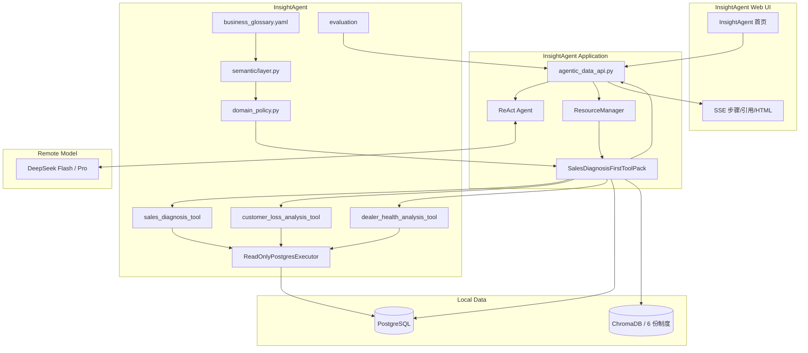
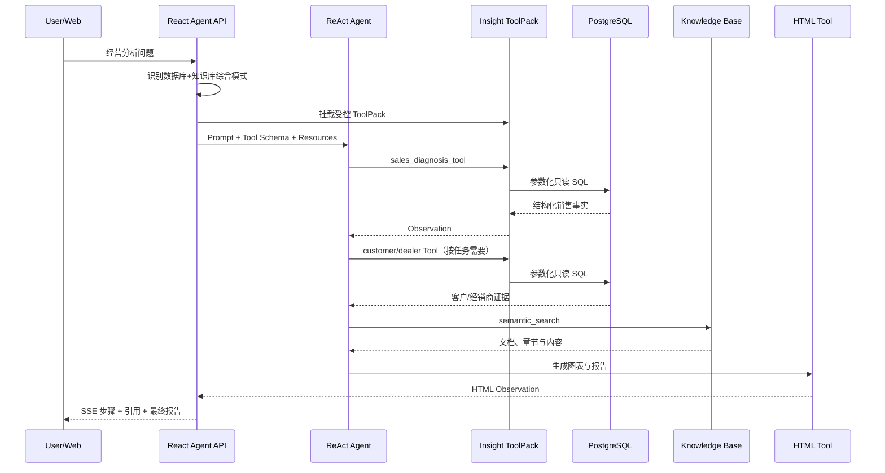
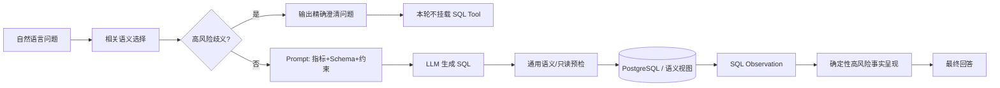
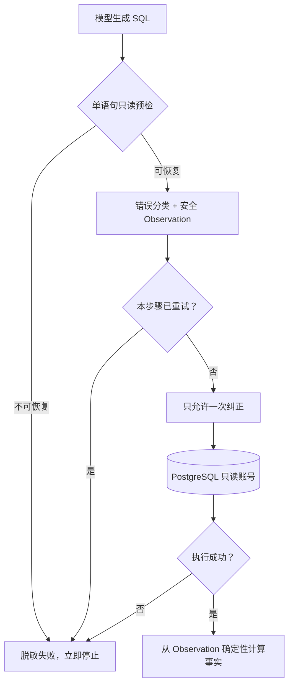
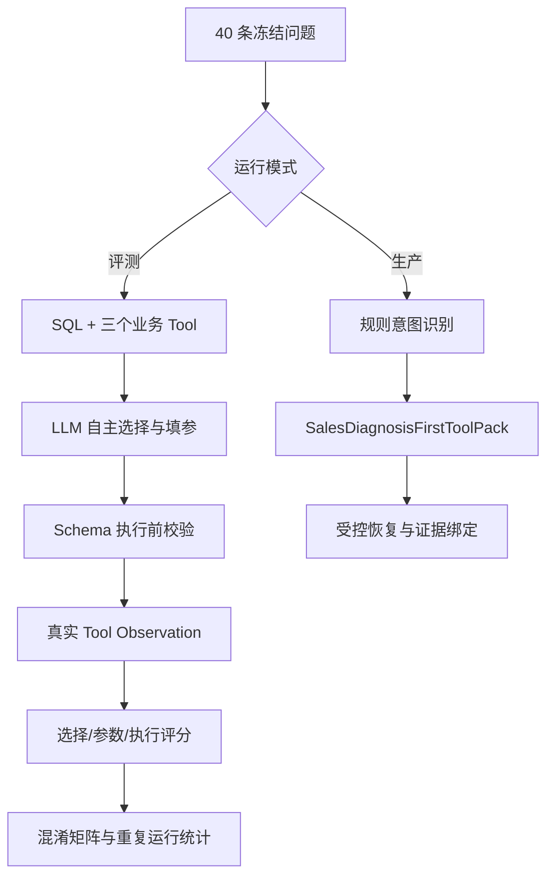
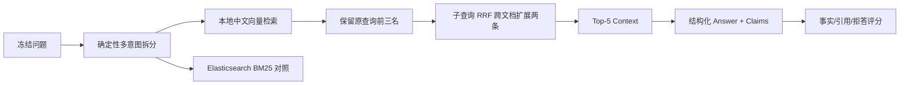
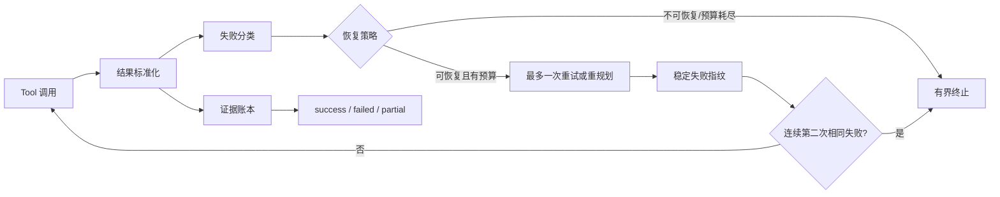

# InsightAgent V1 + Week 1–4 架构与源码调用链

## 1. 系统边界

InsightAgent 由 ReAct 编排层、业务语义层、领域 Tool 层、制度检索层、可靠性控制层和评测层组成。模型连接、数据库访问、向量索引、全文索引与 Web 服务通过第三方依赖提供；本项目实现业务数据、合成制度、确定性领域 Tool、流程门禁、错误恢复、证据合同与专项评测。

## 2. 模块图

## 3. 综合问题时序

## 4. 真实源码路径

1. HTTP 入口：`packages/dbgpt-app/src/dbgpt_app/openapi/api_v1/agentic_data_api.py` 中 `/v1/chat/react-agent`。
2. Tool 注册：`packages/dbgpt-app/src/dbgpt_app/component_configs.py` 把三个业务 Tool 注册到 `ResourceManager`。
3. 业务策略：`insight_agent/agent/domain_policy.py` 负责意图、参数和 SQL 恢复/呈现策略。
4. 顺序与完成门禁：`insight_agent/agent/sales_diagnosis_gate.py`。
5. 领域 Tool：`insight_agent/tools/sales_diagnosis.py`、`customer_loss_analysis.py`、`dealer_health_analysis.py`。
6. 共享数据访问：`insight_agent/tools/db.py` 使用只读角色、短连接和只读事务。
7. 业务语义层：`insight_agent/semantic/layer.py` 按问题选择 `business_glossary.yaml` 中相关指标、字段和歧义规则，而不是把整个词典塞进 Prompt。
8. 语义视图：`insight_agent/database/views.sql` 提供按季度、交易区域、品类、渠道以及客户归属区域聚合的两个只读视图。
9. 评测：`run_eval.py` 负责 V1 综合集；`run_semantic_eval.py` 负责 Week 1 的 dev/test/challenge 语义集；`rescore_semantic.py` 只更新派生评分，不改模型事件、答案和 SQL。
10. Tool 契约：`insight_agent/tools/argument_schemas.py` 定义区域、品类、季度、阈值和 `top_n`；`catalog.py` 构建 Week 2 三组可比较 Tool 表面。
11. Tool Calling 评测：`run_tool_calling_eval.py` 提取真实 SSE Action/Argument/Observation；`tool_calling_metrics.py` 评分选择、参数和执行；`tool_confusion_matrix.py` 聚合重复运行。

## 5. Text-to-SQL 语义链路

语义层支持四种评测配置：`baseline`、`comments`、`glossary`、`combined`。配置通过请求 `ext_info.semantic_profile` 传递；生产默认值为 `combined`，也可由 `INSIGHT_SEMANTIC_PROFILE` 指定。高风险歧义包括指标未指定、时间/对比基准未指定、区域维度不明确和排名周期缺失。

## 6. 一次 SQL 错误恢复

错误覆盖语法、表、列、类型/日期、分组、列歧义、权限、超时和未知错误。权限和未知错误不重试；失败 SQL 相同时阻断重复执行。

## 7. 数据、规则与建议分层

- 数据事实：必须来自 SQL 或领域 Tool Observation。
- 规则判断：必须标明制度文档/章节，或声明为 V1 演示规则。
- 经营建议：可由模型组织，但必须与前两层证据绑定。
- 不得把相关性写成唯一因果，不得把预警写成已确认流失。

## 8. 安全与隐私边界

- 业务数据与制度全部为合成资产。
- Tool 连接使用 `insight_readonly`，数据库权限是最终写入防线。
- API Key 和数据库密码仅通过运行时环境变量提供。
- 本地 ChromaDB/本地 Embedding 不代表完全离线；发送给 DeepSeek API 的 Prompt 和 Context 仍会离开本机。
- V1 不宣称已具备 RBAC、Document ACL、租户隔离或生产审计。

## 9. 架构取舍

- 不引入 LangGraph：V1 的可靠性问题可以在 InsightAgent 现有扩展点内用可测量方式解决。
- 不训练经销商风险模型：没有真实标签，可解释规则比伪机器学习更诚实。
- 确定性呈现只覆盖高风险数值：保留 Agent 的语言组织能力，避免它重抄和重算核心事实。
- 每个步骤最多重试一次：在成功率、延迟、成本和防循环之间取得明确边界。
- 语义选择而非全量注入：降低无关 Prompt 噪声，同时保持 YAML 口径可审计、可版本化。
- 严格结果集与答案事实分开：观察“SQL 返回形状”和“用户最终得到的事实”两个不同故障面。

## 10. Week 2 Tool Calling 双轨链路

评测模式通过请求 `ext_info.tool_calling_profile` 显式启用，只允许 `sql_query`、三个业务 Tool 和 `terminate`。该模式不调用 `select_domain_tool()`，不使用首 Tool 强制门禁，也不执行缺失 Action 恢复，因此指标反映模型看到 description 和参数 Schema 后的真实行为。

生产模式保持原来的规则路由、流程门禁和确定性恢复。两类结果分开报告：前者回答模型是否会选，后者回答用户任务是否最终可靠完成。

## 11. 参数 Schema 与失败边界

InsightAgent `FunctionTool` 的 Schema 校验是向后兼容的显式选项。未启用的原有 Tool 保持旧执行行为；启用后，Pydantic 的枚举、正则和数值范围进入 Tool Prompt，并在函数产生副作用前校验。未知字段不会再被 ToolPack 静默删除，而是返回可修复的结构化错误。

三个业务 Tool 均启用该能力。季度必须是 `YYYYQn`，区域和品类使用受控枚举，`top_n` 限制为 1–20，客户下降阈值限制为 `(0, 1]`。验证失败时不会创建 PostgreSQL 执行器，也不会产生数据库查询。

## 12. Week 2 结果与协议边界

首次验收中，Flash `boundary` 参数有效率为 94.17%，Pro 选择准确率为 40%；24 条选择失败中有 23 条没有形成 Tool Action，主要是模型使用一行式、JSON、蛇形字段或全角冒号 ReAct，而原解析器只接受窄格式文本协议。

修复后的解析器兼容上述有明确 Action 的结构化表达，但不会根据裸业务参数字典猜测 Tool；裸 `sql` 与 `output/result` 只映射到系统级 `sql_query` 与 `terminate`。同一冻结集重新验收中，Flash `boundary` 选择准确率 99.17%、参数有效率 100%，Pro 为 97.5% 与 100%，三个业务 Tool 召回率均为 100%。

生产模式三条烟测仍全部通过，综合任务实际顺序为 `sales_diagnosis_tool`、`semantic_search`、`html_interpreter`。规则门禁保障演示可靠性，但生产成功率不替代隔离评测；同集修复回归也不等同于独立盲测，首次 14/40 必须保留披露。

## 13. Week 3 RAG 检索与引用链路

- 正式语料为 6 份合成制度；4 份旧版、外部建议和临时通知只进入隔离实验索引。
- 向量与 BM25 共运行 54 组 `chunk_size × overlap × top_k` 检索矩阵。
- 最终配置为 BGE 中文 Embedding、Chroma、512/50、Top-5 与确定性多意图拆分。
- 每条 Claim 必须绑定文档名、章节和可在检索片段定位的证据短句。
- 无答案题必须显式说明证据不足且不得生成 Claim。
- 唯一 Pro 最终轮保留自动 81.90% 与逐题人工 92.86% 两套事实准确率，不用人工结果覆盖自动原始值。

## 14. Week 4 统一失败恢复与完成合同

- `reliability/failure_types.py` 将无故障、参数、SQL 可修复、无数据、RAG 空召回、权限、Tool 异常、超时、流程阻断和未知故障统一分类。
- `retry_policy.py` 为请求设置一次共享恢复预算；权限拒绝等不可恢复错误直接终止。
- `trajectory_guard.py` 对规范化 Tool、参数和错误生成稳定指纹，连续第二次相同失败即打开断路器。
- `completion.py` 只允许已验证证据进入完成判断；部分成功保留事实并显式返回 `partial`，请求级超时也沿用同一合同。
- `tool_pack.py` 将分类、策略、预算、指纹、事件和证据账本接入 InsightAgent ToolPack；评测故障注入仅在 `INSIGHT_AGENT_RELIABILITY_EVAL=1` 时启用。

评测桥采用异步流式转发，避免同步上游请求阻塞事件循环。生产综合任务上限为 5 步，
依靠确定性三阶段计划和证据绑定 fallback 完成；冻结可靠性 Benchmark 为覆盖混合故障保留
数据库 5、知识 6、综合 8 的逐题上限，两者属于不同配置边界。

20 题 Flash After 三轮恢复率为 100%、100%、91.67%。Pro 原始轮为 66.67%；轨迹
显示其更常输出 CLI 风格 `kb_grep` 参数、数值字符串并在换 Tool 后重新获得恢复机会。
可靠性层因此只做无损别名/标量归一，将预算收敛为请求级一次，并在隔离故障评测中执行
一次可审计的有界自动恢复；持续故障、预期失败和报告超时仍失败关闭。Pro 同一冻结集
回归达到 91.67%，总通过率 90%，有界终止 100%，盲重试和断路后调用均为 0%。
该结果是失败分析后的同集回归，不代表独立泛化能力。
