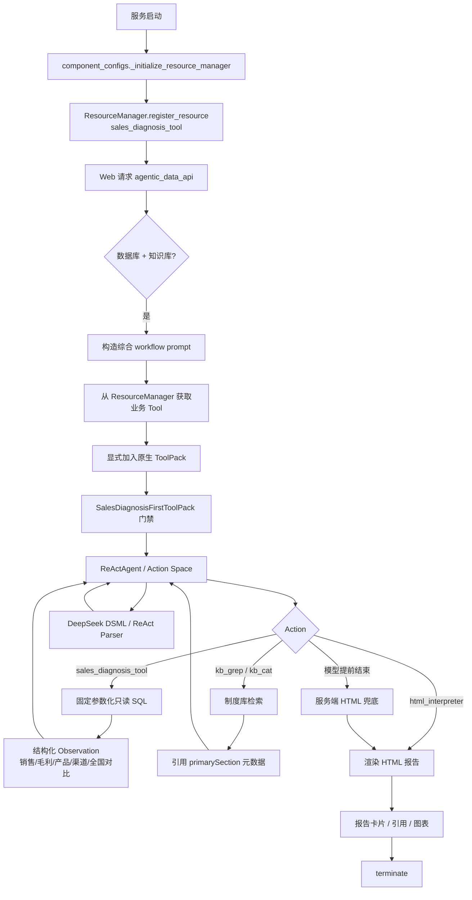

# Day 3 源码主链路图

关键源码入口：

- Tool：`insight_agent/tools/sales_diagnosis.py`
- 门禁：`insight_agent/agent/sales_diagnosis_gate.py`
- 注册：`packages/dbgpt-app/src/dbgpt_app/component_configs.py`
- Web 主流程：`packages/dbgpt-app/src/dbgpt_app/openapi/api_v1/agentic_data_api.py`
- DSML 解析：`packages/dbgpt-core/src/dbgpt/agent/util/react_parser.py`
- 引用链路：`packages/dbgpt-app/src/dbgpt_app/openapi/api_v1/tools/knowledge_retrieve.py`
